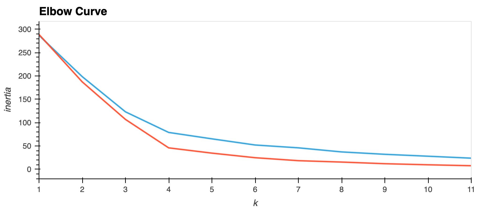
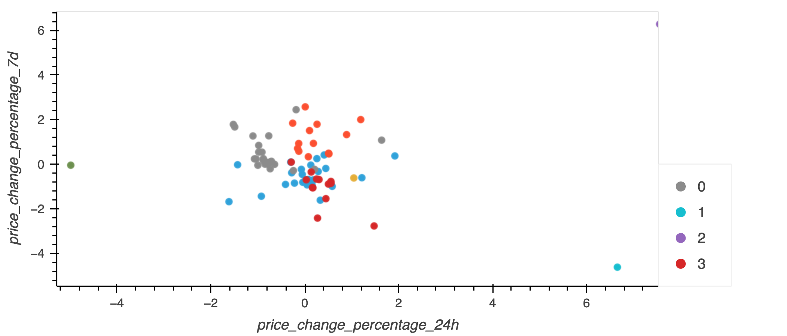
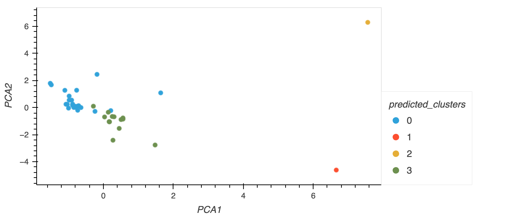

# Challenge - Unsupervised Learning

This challenge demonstrates the usage of unsupervised learning with k-means clustering.

Using the provided data on [Crypto Currencies](Resources/crypto_market_data.csv). 
The analysis, plots, and code can be found in [`Crypto_Clustering.ipynb`](Crypto_Clustering.ipynb)

- First, I normalized the data using `StandardScaler()` from `scikit-learn`. 
- Using this data, I then used the elbow method to find the best value for `k`.
- From the elbow method line chart, I determined that the best value for `k` is 4.   
- Then  I fit the data with a k-means model to cluster the different crypto currencies into 4 groups then plotted the groups in a scatter plot. 
- Then  I used Principal Component Analysis (PCA) to reduce the features down to 3.
- The explained variance of these three features was 89%. 
- I repeated the process of using the elbow method and fitting the data with a k-means model.
- I used  PCA and the elbow method, the best value of `k` was again determined to be 4 again, coming to the conclusion that PCA with 3 features was appropriate for this data set.
      
-At the end of analysing this data set , I compared the the elbow curves and the scatter plots before and after PCA.  it appears that using fewer features (PCA data) to cluster the cryptocurrency data using K-Means has had a positive impact. It has resulted in better-defined and separable clusters compared to using the initial data. The reduction in the number of features through PCA has likely helped to highlight the essential patterns and reduce the impact of noise, leading to more accurate and meaningful clustering results
Images are shown below.
    
    
### Plots

